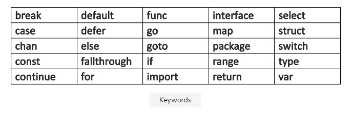
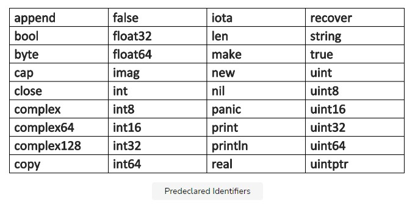

# Basic Constructs and Elementary Data Types

## Filenames, Keywords and Identifiers

### Filename

Go source code is stored in .go files. Their filenames consist of lowercase-letters, like educative.go. If the name consists of multiple parts, they are separated by underscores ‘\_’, like educative_platform.go. Filenames cannot contain spaces or any other special characters.

### Keyword

A reserved word, with a special meaning in a programming language, is called a keyword. Below is the set of 25 keywords, or reserved words, used in Go-code:

### Identifiers

An identifier is a name assigned by the user to a program element like a variable, a function, a template, and a class, etc. Nearly all things in Go-code have a name or an identifier. Like all other languages in the C-family, Go is case-sensitive. Valid identifiers begin with a letter (a letter is every letter in Unicode UTF-8) or \_ and are followed by 0 or more letters or Unicode digits, like X56, group1, \_x23, i, and өԑ12.

The following are NOT valid identifiers:

- 1ab because it starts with a digit
- case because it is a keyword in Go
- a+b because operators are not allowed

#### Blank identifier

The _ itself is a special identifier, called the blank identifier. Like any other identifier, _ can be used in declarations or variable assignments (and any type can be assigned to it). However, its value is discarded, so it can no longer be used in the code that follows.

#### Anonymous

Sometimes it is possible that even functions have no name because it is not really necessary at that point in the code and not having a name even enhances flexibility. Such functions are called anonymous.

### The basic structure of a Go program

Programs consist of keywords, constants, variables, operators, types and functions. It is also important to know the delimiter and punctuation characters that are a part of Golang.

The following delimiters are used in a Go program:

- Parentheses ()
- Braces {}
- Brackets []

The following punctuation characters are used in a Go program:

- .
- ,
- ;
- :
- ...

The code is structured in statements. A statement doesn’t need to end with a ; (like it is imposed on the C-family of languages). The Go compiler automatically inserts semicolons at the end of statements. However, if multiple statements are written on one line (a practice which is not encouraged for readability reasons), they must be separated by ;.
