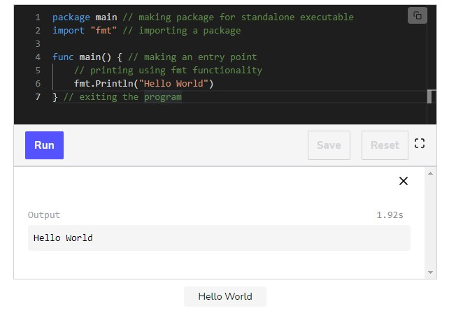
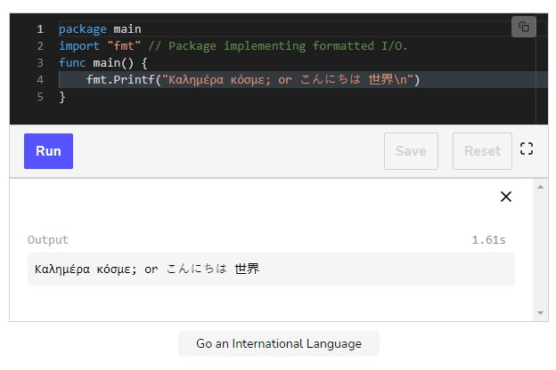

# Basic Constructs and Elementary Data Types

## Filenames, Keywords and Identifiers

### Filename

Go source code is stored in .go files. Their filenames consist of lowercase-letters, like educative.go. If the name consists of multiple parts, they are separated by underscores ‘\_’, like educative_platform.go. Filenames cannot contain spaces or any other special characters.

### Keyword

A reserved word, with a special meaning in a programming language, is called a keyword. Below is the set of 25 keywords, or reserved words, used in Go-code:

### Identifiers

An identifier is a name assigned by the user to a program element like a variable, a function, a template, and a class, etc. Nearly all things in Go-code have a name or an identifier. Like all other languages in the C-family, Go is case-sensitive. Valid identifiers begin with a letter (a letter is every letter in Unicode UTF-8) or \_ and are followed by 0 or more letters or Unicode digits, like X56, group1, \_x23, i, and өԑ12.

The following are NOT valid identifiers:

- 1ab because it starts with a digit
- case because it is a keyword in Go
- a+b because operators are not allowed

#### Blank identifier

The _ itself is a special identifier, called the blank identifier. Like any other identifier, _ can be used in declarations or variable assignments (and any type can be assigned to it). However, its value is discarded, so it can no longer be used in the code that follows.

#### Anonymous

Sometimes it is possible that even functions have no name because it is not really necessary at that point in the code and not having a name even enhances flexibility. Such functions are called anonymous.

### The basic structure of a Go program

Programs consist of keywords, constants, variables, operators, types and functions. It is also important to know the delimiter and punctuation characters that are a part of Golang.

The following delimiters are used in a Go program:

- Parentheses ()
- Braces {}
- Brackets []

The following punctuation characters are used in a Go program:

- .
- ,
- ;
- :
- ...

The code is structured in statements. A statement doesn’t need to end with a ; (like it is imposed on the C-family of languages). The Go compiler automatically inserts semicolons at the end of statements. However, if multiple statements are written on one line (a practice which is not encouraged for readability reasons), they must be separated by ;.

## Import Functionality

### Packages

A library, module, or namespace in any other language is called a package. Packages are a way to structure code. A program is constructed as a package which may use facilities from other packages. A package is often abbreviated as ‘pkg’.

Every Go file belongs to only one package whereas one package can comprise many different Go files.

The package to which the code-file belongs must be indicated on the first line. A package name is written in lowercase letters.

package main

A standalone executable belongs to main. Each Go application contains one main.

An application can consist of different packages. But even if you use only package main, you don’t have to stuff all code in 1 big file. You can make a number of smaller files, each having package main as the 1st line of code.

If you compile a source file with a package name other than main, e.g., pack1, the object file is stored in pack1.a.

### Package dependencies

To build a program, the packages, and the files within them must be compiled in the correct order. Package dependencies determine the order in which to build the packages. Within a package, the source files must all be compiled together.

The package is compiled as a unit, and by convention, each directory contains one package. If a package is changed and recompiled, all the client programs that use this package must be recompiled too!

### Import keyword

A Go program is created by linking set of packages together, with the import keyword. For example, if you want to import a package say fmt, then you do:

package main
import "fmt"

import "fmt" tells Go that this program needs functions, or other elements from the package fmt, which implements a functionality for formatted IO. The package names are enclosed within " ".

Import loads the public declarations from the compiled package; it does not insert the source code. If multiple packages are needed, they can each be imported by a separate statement.

import "fmt"
import "os"

import "fmt"; import "os"

Go has provided us with a shorter and more elegant way of importing multiple packages known as factoring the keyword.

import (
"fmt"
"os"
)

Factoring means calling a keyword once on multiple instances. You may have noticed that we imported two packages using a single import keyword. It is also applicable to keywords like const, var, and type.

### Visibility

Packages contain all other code objects apart from the blank identifier (\_). Also, identifiers of code-objects in a package have to be unique which means that there can be no naming conflicts.
However, the same identifier can be used in different packages. The package name qualifies a package to be different.

### Visibility rule

Packages expose their code objects to code outside of the package according to the following rule enforced by the compiler:

When the identifier (of a constant, variable, type, function, struct field, …) starts with an uppercase letter, like, Group1, then the ‘object’ with this identifier is visible in code outside the package (thus available to client-programs, or ‘importers’ of the package), and it is said to be exported (like public identifiers/variables in OO languages). Identifiers that start with a lowercase letter are not visible outside the package, but they are visible and usable in the whole package (like private identifiers/variables).

Note: Capital letters can come from the entire Unicode-range, like Greek; not only ASCII letters are allowed.

Importing a package gives access only to the exported objects in that package. Suppose we have an instance of a variable or a function called Object (starts with O so it is exported) in a package pack1.

Importing a package gives access only to the exported objects in that package. Suppose we have an instance of a variable or a function called Object (starts with O so it is exported) in a package pack1. When pack1 is imported in the current package, Object can be called with the usual dot-notation from OO-languages:

pack1.Object

Packages also serve as namespaces and can help us avoid name-conflicts. For example, variables with the same name in two packages are differentiated by their package name, like pack1.Object and pack2.Object.

A package can also be given another name called an alias. If you name a package then its alias will be used throughout the code, rather than its original name. For example:

import fm "fmt"

Now in the code, whenever you want to use fmt, use its alias:fm (not fmt).

Note: Go has a motto known as “No unnecessary code!”. So importing a package which is not used in the rest of the code is a build-error.

That’s how functionalities are imported in the Golang.

## Overview of Functions

### Functions

The simplest function declaration has the format:

func functionName()

Between the mandatory parentheses ( ) no, one, or more parameters (separated by ,) can be given as input to the function. After the name of each parameter variable must come its type.

The main function as a starting point is required (usually the first function), otherwise the build-error: undefined: main.main occurs. The main function has no parameters and no return type (in contrary to the C-family) otherwise, you get the build-error: func main must have no arguments and no return values. When the program executes, after initializations the first function called (the entry-point of the application) will be the main.main() (like in C). The program exits immediately and successfully when main.main returns.

The code or body in functions is enclosed between braces { }. The first { must be on the same line as the declaration otherwise you get the error: syntax error: unexpected semicolon or newline before { ). The last } is positioned after the function-code in the column beneath the function. The syntax is as follows:

func func_Name(param1 type1, param2 type2, ...){
...
}

If the function is returning an object of type type1, we follow the syntax as:

func func_Name(param1 type1, param2 type2, ...) type1 {
...
}

or :

func func_Name(param1 type1, param2 type2, ...) ret1 type1 {
...
}

where ret1 is a variable of type type1 to be returned. So a general function returning multiple variables looks like:

func func_Name(param1 type1, param2 type2, ...) (ret1 type1, ret2 type2, ...) {
...
}

Smaller functions can be written on one line like:

func Sum(a, b int) int { return a + b }

Let’s create the main function now as an entry point.

package main
import "fmt"

func main(){
}

The main structure of a Go program is ready.

### Hello World 🌍

BINGO! We just made our first Go program using the components above. At line 1, we make a package main and then import package fmt to get the functionality of formatted IO at line 2. At line 4, we make a main function to add an entry point, and at line 6, we print Hello World with fmt.Println("Hello World"). This function Println from the fmt package takes a parameter and prints it on the screen.

### Comments

Explanation of source code added to a program as a text note is called a comment.
In Go, a one-line comment starts with //. A multi-line or block-comment starts with /_ and ends with _/, where nesting is not allowed.

This illustrates the international character of Go by printing Καλημέρα κόσμε; or こんにちは 世界.

### Naming things in Go

Clean, readable code and simplicity are major goals of Go development. Therefore, the names of things in Go should be short, concise, and evocative. Long names with mixed caps and underscores which are often seen e.g., in Java or Python code, sometimes hinder readability. Names should not contain an indication of the package. A method or function which returns an object is named as a noun, no Get… is needed. To change an object, use SetName. If necessary, Go uses MixedCaps or mixedCaps rather than underscores to write multiword names.
